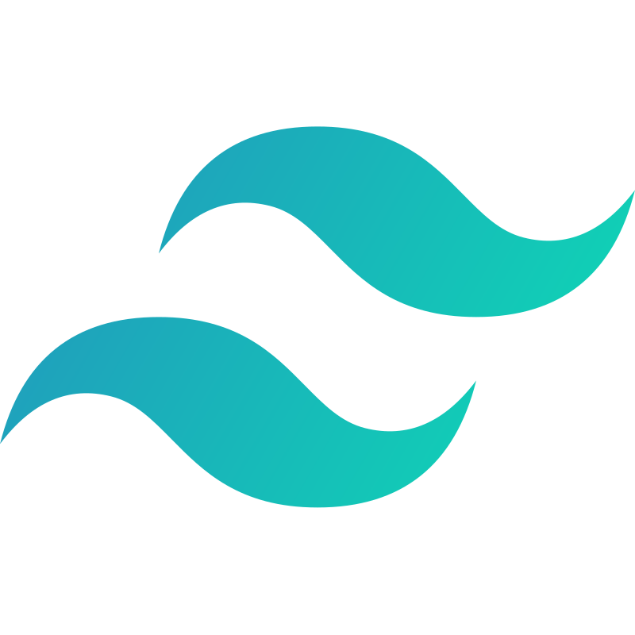

                                                                                                                                     
 <h3 align='center'>Languages and Tools :</h3>

    </img>
    </img>
    </img>
    </img>
    </img>
    </img>
    </img>
    </img>
    </img>
    </img>
    </img>

 
 

 
 

### Top Repositories : 

 
 

### Connect with me :

